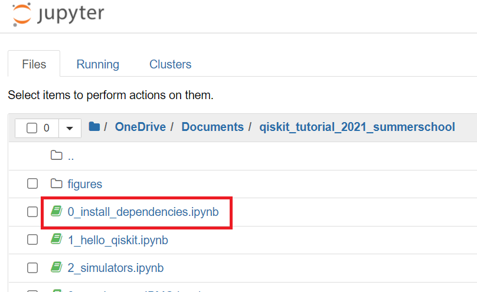

# 1. Installation

## 1-1. Install Anaconda
(https://www.anaconda.com/distributuion)

## 1-2. Setup Virtual Environment
Open anaconda navigator


## 1-3. Install Jupyter Notebook


## 1-4. Launch Powershell


## 1-5. Launch jupyter notebook
1. 튜토리얼 파일이 있는 곳으로 이동 (윈도우 탐색기)
2. 주소 복사
3. Powershell에 아래 명령어 차례대로 입력

```bash
cd <Copied Addr>
jupyter notebook
```


## 1-6. Install Dependencies



# 2. IBMQ Account
(https://quantum-computing.ibm.com/)


